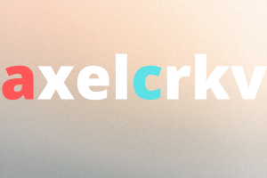

# Dicee (Ejercicio del iOS Bootcamp)

## Meta

Introducción al core programming de Swift, creando una pequeña y simple app de Dice Roll

## Aprendizajes

* Clonar un archivo de Github y subirlo a mi repositorio personal
* Crear una aplicación con controllers y funcionalidades
* Crear un enlace entre los archivos del Interface Builder y codificarlos mediante IBActions y IBOutlets.
* Variables y constantes de Swift.
* Arrays de Swift
* Testeo y debugging en XCode
* Randomización

